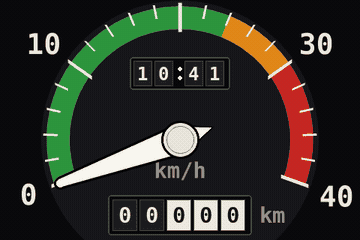
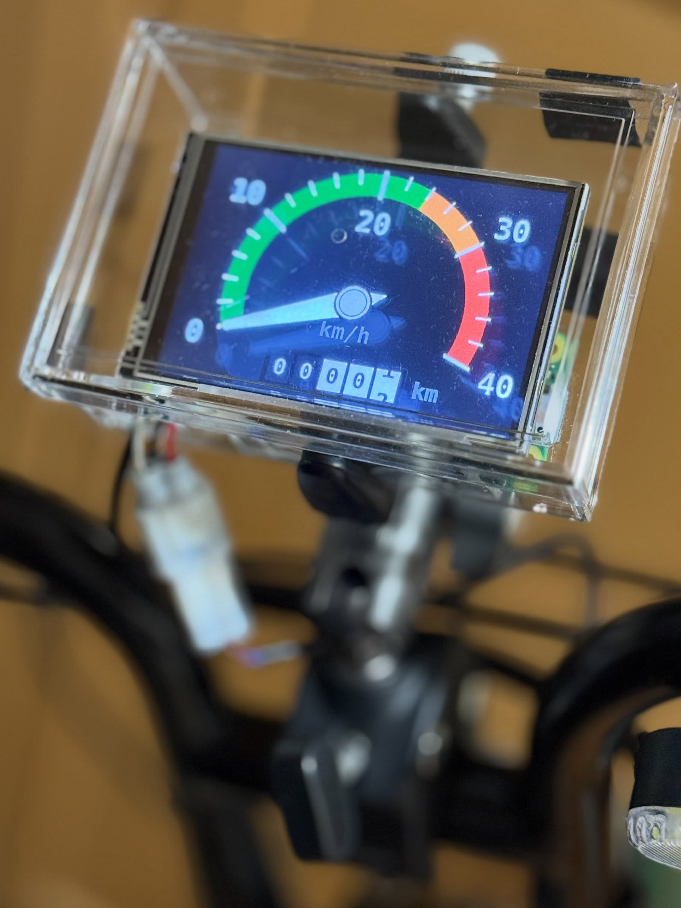
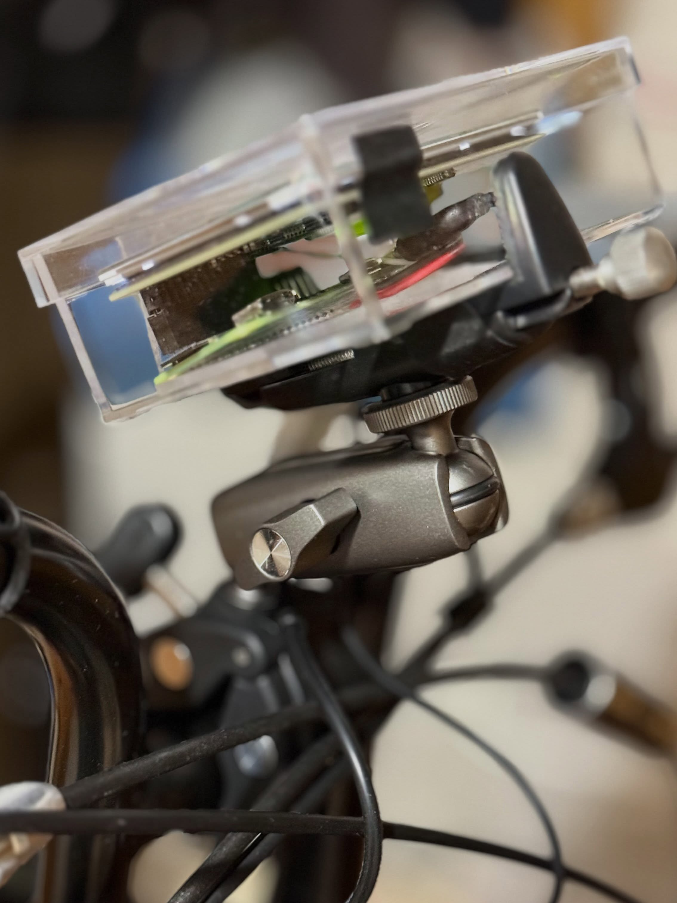
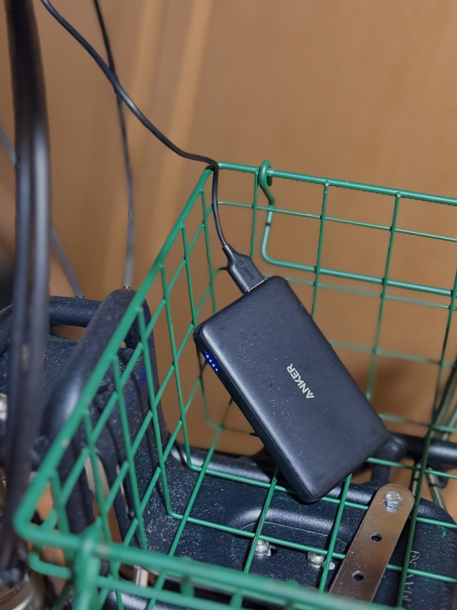
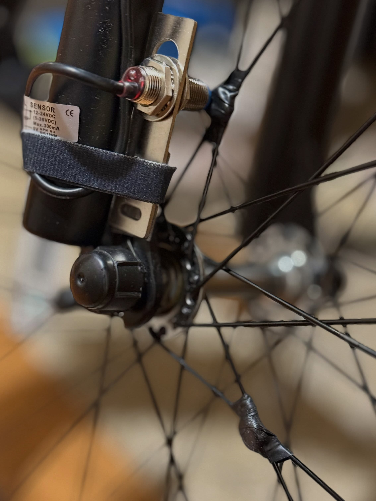

# Cyclometer

A home-built bike computer for a Panasonic EZ (2025), a Japanese
power-assisted bicycle.

It recreates the look of the analogue speedometers fitted to Japanese
children's bicycles in the 1970s, using a Raspberry Pi Zero 2 WH and a
3.5-inch LCD. Magnets on the front wheel pass a Hall sensor, and the
intervals between pulses give speed, distance and acceleration.

<p align="center">
  
</p>

<p align="center">
  
</p>

Compared with a GPS-based bike computer, a wheel sensor wins on:

- **Update rate** — about 11 pulses per second at 20 km/h, against
  0.25 Hz for a typical phone GPS track
- **Speed accuracy** — it counts revolutions rather than differencing
  positions, so metre-scale positioning error never enters the reading
- **Responsiveness** — the measurement is clean enough that no heavy
  smoothing is needed, so it does not lag behind acceleration
- **Where it works** — narrow streets, tunnels and indoors are all fine

Measured against a GPS track of the same ride, the difference was
largest exactly where GPS struggles: slow riding and U-turns. In one
90-second stretch at walking pace the GPS trace accumulated over 300 m
of path while the wheel had turned only 143 m.

---

## Why the green zone stops at 24 km/h

Japan has a legal category of its own for power-assisted bicycles
(電動アシスト自転車). A machine in this category is treated as a
bicycle rather than a moped: no licence, no registration, no helmet
requirement, and it may use bicycle lanes and paths.

To qualify, the motor must not simply propel the bike. It may only
amplify what the rider is already doing, within strict limits:

| Speed | Maximum assist |
|---|---|
| below 10 km/h | up to 2× the rider's own effort |
| 10 – 24 km/h | tapering off linearly |
| 24 km/h and above | **zero** |

There is no throttle. Above 24 km/h the rider is entirely on their own,
and any further speed comes from gravity or leg power alone.

The dial is coloured to show this directly:

- **green, 0 – 24 km/h** — the motor is helping
- **amber, 24 – 30 km/h** — past the cut-off, unassisted
- **red, 30 – 40 km/h** — descending under gravity

So the boundary between green and amber is not a design flourish; it is
the point where the bicycle stops being a power-assisted bicycle and
becomes an ordinary one. Riders feel this transition but rarely see it,
and putting it on the dial turns a legal threshold into something you
can read at a glance.

For comparison, the EU limit is 25 km/h and US Class 1 is 20 mph
(32 km/h), so a dial built for another market would be divided
differently.

---

## Hardware

| | |
|---|---|
| Computer | Raspberry Pi Zero 2 WH |
| Display | 3.5-inch SPI TFT, 480×320, with touch panel |
| Sensor | NJK-5002C Hall proximity switch, NPN open collector, M12 |
| Magnets | 3 neodymium magnets, 120° apart on the front wheel |
| Power | 5 V USB power bank |
| Software | Python 3 with pygame and libgpiod |

<p align="center">
  
  
</p>

---

## Wiring

<p align="center">
  
</p>

The sensor is clamped to the front fork; the magnets sit where the
spokes cross, at a radius of about 70 mm.

| Sensor lead | Connect to |
|---|---|
| brown (V+) | 5 V, header pin 2 |
| blue (V−) | GND, e.g. header pin 39 |
| black (OUT) | GPIO16, header pin 36 |

The NJK-5002C needs 5 V to run, but its output is an open collector: it
can only pull the line down, never drive it high. **Pull the output up
to 3.3 V and it connects straight to a 3.3 V GPIO**, whatever the
sensor's own supply voltage is. The code enables the internal pull-up,
so no external resistor is required.

The 3.5-inch display occupies header pins 1–26, so the signal and
ground lines use pins from 27 upward.

---

## Running it

```bash
sudo apt install python3-pygame python3-libgpiod
git clone https://github.com/kimux/cyclometer.git
cd cyclometer
```

**Analogue dial**

```bash
python3 gauge.py
```

**Console monitor** — for setting up magnets and diagnosing the sensor

```bash
python3 measure.py
```

**Without hardware** — works on a Mac too

```bash
python3 gauge.py --simulate --windowed --clock on
python3 measure.py --simulate
```

**Render one frame** — speed:distance:peak, for working on the dial

```bash
python3 gauge.py --shot 27.3:12.345:36.4
```

Ride logs are written next to the script as `ride-NNNN.csv`, numbered
sequentially. Use `--log-dir` to put them elsewhere.

---

## The display

- **Speed** — 0 to 40 km/h, with the assist cut-off marked by the change
  from green to amber
- **Odometer** — mechanical drum style; the last digit rolls
  continuously, one metre per step, and there is no printed decimal
  point: the fractional digits are reversed out in white instead, the
  way a real odometer distinguishes them
- **Clock** — shown only when NTP has actually set the time. The Zero 2 W
  has no battery-backed clock, so an unsynchronised time would be
  quietly wrong and is not displayed at all
- **Peak** — a red dot marks the fastest the needle has reached
- **Warning** — a lost magnet is reported in the bottom-left corner

---

## Things worth knowing

### Never set a debounce period on the GPIO line

Passing `debounce_period` to `gpiod.LineSettings` **silently loses
pulses at speed.**

BCM2835 has no hardware debounce, so the kernel emulates it: after the
edge interrupt it schedules delayed work and re-reads the line. The
delay is rounded up to a jiffy — 1 ms at HZ=1000 — and the event is
timestamped at the re-read rather than at the edge.

Any pulse shorter than that delay is therefore **discarded entirely**.
Since a magnet sweeps past faster the faster you go, the loss rate rises
in proportion to speed. In this project it reached 71% at 7 km/h before
the cause was found.

A Hall sensor has a Schmitt trigger on its output and does not bounce,
so debouncing is unnecessary. Noise is rejected in software instead, as
anything implying an impossible speed (above 90 km/h).

### Measure the wheel circumference

For 20×1.75 (ETRTO 47-406), the tables printed in bike computer manuals
give 1515 mm. That corresponds to a 482 mm outer diameter, which does
not match the tyre:

```
outer diameter = 406 + 47×2 = 500 mm
circumference  = π × 500 ≈ 1571 mm (unloaded)
```

Comparing straight sections of a GPS track against the wheel count put
the real figure near **1560 mm**, which is what this repository uses.
Load and tyre pressure both change it, so a roll-out measurement — mark
the tyre, roll the bike one full turn with the rider aboard, measure —
is still worth doing.

### Take speed from a full revolution

With more than one magnet, any error in their angular placement feeds
straight into the speed reading. Measured here, the three gaps came out
as 122.8° / 113.8° / 123.4°, up to 6° from the ideal 120°.

The fix is to time **N pulses back**, which is exactly one revolution.
The window always spans a whole turn, so **placement error cancels
completely regardless of which magnet the window starts on** — while
still updating once per pulse rather than once per revolution.

### Kalman filter

Speed and acceleration are estimated with a constant-acceleration
Kalman filter, which keeps predicting between pulses instead of holding
the last value.

One detail matters for accuracy: a pulse gives the **average** speed
over its interval, not the instantaneous speed at its end. Under
constant acceleration the average equals the instantaneous value at the
interval's midpoint, so each measurement is applied at that midpoint
time. Without this, every estimate lags by half an interval.

Replaying a real ride, the filter reported a peak of 30.7 km/h against
30.6 km/h from the one-revolution window — **the peak is not smoothed
away** — while the median difference between the two during steady
riding was 0.14 km/h. A 20-second moving average of the same data cut
that peak down to 22.8 km/h.

---

## Files

| | |
|---|---|
| `measure.py` | Measurement layer: pulse input, speed, distance, acceleration, CSV logging. Also runs standalone as a console monitor |
| `gauge.py` | Display layer: imports `measure.py` and draws the dial |

`RideModel` in `measure.py` has no hardware dependencies, so past logs
can be replayed as ordinary Python on a laptop to check the algorithms.

---

## Log format

| Column | Meaning |
|---|---|
| `t_ns` | CLOCK_MONOTONIC nanoseconds — use this for analysis |
| `wall_iso` | Wall clock; trustworthy only where `clock_synced` is 1 |
| `clock_synced` | 1 when NTP has set the clock this boot |
| `pulse_index` | Cumulative pulse count |
| `interval_s` | Time since the previous pulse |
| `width_s` | Pulse width — how long the magnet was in range. A good proxy for mounting quality |
| `speed_kmh` | From the one-revolution window |
| `speed_inst_kmh` | From the latest pulse only |
| `speed_kf_kmh` | Kalman estimate |
| `accel_mps2` | Acceleration, positive when speeding up |
| `distance_m` | Cumulative distance |
